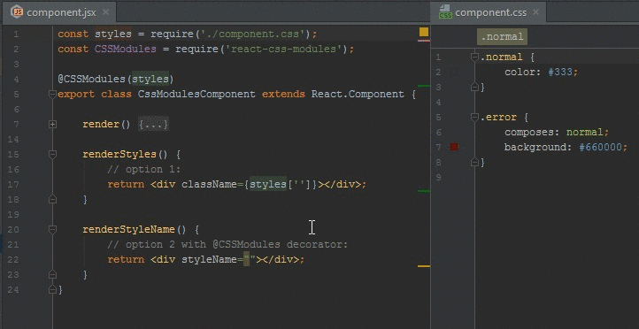

# React CSS Modules IntelliJ Plugin

React CSS Modules support for components written in JavaScript and TypeScript.

It provides the following features in IntelliJ IDEA, WebStorm, RubyMine, PhpStorm, and PyCharm:

- Completion and error highlighting for require'd CSS classes used in React `styleName` attributes
- Completion and error highlighting for require'd CSS classes used in styles string literals, e.g. `styles['my-class']`
- Intention to create missing CSS class from usage in React
- Integrates React references to CSS class names with 'Find Usages', 'Rename', and 'Go to Declaration'

## Features demo

**Completion, error highlighting, find usages**

## Known limitations

`@value` shows "Unknown CSS at-rule" error in the editor. There doesn't appear to be an API hook for adding @value as a known rule, or for filtering the error. To remove the error marker (but also other at-rule error markers) disable the inspection.

Accessing style names via fields (e.g. `styles.myClassName`) is not supported. There doesn't appear to be any PSI API hooks for achieving this. Instead, use `styles['my-class-name']` which also doesn't limit class names to camel-case.

The plugin assumes a one-to-one relationship between a React component and the require'd .css/.scss/.less file.

PR's are welcome.

## FAQ

**Does this also work with .scss and .less files?**

Yes. It should work for all CSS dialects supported by the IntelliJ platform.

**Which IDEs are compatible with the plugin?**

The plugin is compatible with version 163+ (2016.3 or newer) of IntelliJ IDEA, WebStorm, RubyMine, PhpStorm, and PyCharm. 2016.3 is the first official version that supports `:global`, `:local`, and `composes` used by CSS Modules.

PyCharm CE is not supported since the plugin depends on two other plugins: NodeJS and JavaScript.

**Where can I get the plugin?**

The plugin will be released using the JetBrains Plugin Repository in the near future.

## License
MIT
